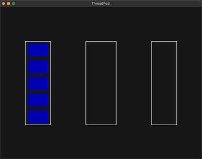

基于VulkanLearning视频的简单引擎实现的线程池可视化

https://github.com/blurrypiano/littleVulkanEngine/tree/master

左边是线程池，中间是任务执行区域，右边是任务等待区域

按1～5可以生成执行时间为1～5秒的睡眠任务

实际上是3D项目，按键盘的按键可以移动摄像机，可以看到任务初始地点以及各个矩形的层级：

+ Q:向下，E:向上
+ W:向前，S:向后
+ A:向左，D:向右
+ 上下左右旋转

**v0.1**

+ 简单的可视化，项目有不可复现的bug，没有去掉原有项目的特性，以及分层一团糟的问题

**v0.2**

+ 给bug打上补丁，bug仍然存在，大概率是多线程导致，README添加动图

**v0.3**

+ 大概修复了bug，原因是任务队列系统写挂了，但具体逻辑未知

+ 把原项目中用不到的特性进行删除

+ 更改一些移动时逻辑

**v0.4**

+ 修复了部分物体模型坐标和世界坐标混搭导致Z轴无法区分的问题（但三个系统的白框是固定不动的，就不修了）

+ 仿照Piccolo小引擎分级，但有点照猫画虎，不伦不类，https://github.com/BoomingTech/Piccolo

+ 修复包含文件需要 #include"../" 的问题

**v1.0**

+ 修改TaskSystem的逻辑，将所有任务放到一个队列中，不区分框内和框外两个队列

+ 实现异步执行，具体逻辑是使用TaskResult类封装结果，返回一个optional类，如果任务完成，则返回任务所需返回值，否则返回一个空的optional类

+ 异步执行中如果需等待该任务，则直接锁住任务队列不允许加入（参考《游戏引擎架构》第二版334页），但为防止主线程卡住，只能每一帧询问一次结果，若任务完成，解锁

+ 基本完成所有功能，更新为1.0

**待实现（可能也不会实现）：**

+ 更好的异步执行（暂时没有思路）

+ 尝试更好的分层（在摆了在摆了）

+ 任务执行完删除资源（由于验证层报错，但不会修，可能不修了，接口已经准备好了，只需要在循环中加上gameObjectManager->tick();即可，由于新增任务回调，接口暂未修改，建议不删除）

+ 模仿Piccolo小引擎优化主循环（VulkanLearning项目遗留问题，不太会改）

+ v1.0大改后未进行良好的测试，可能有bug（这版写起来感觉有点掌控不住）

