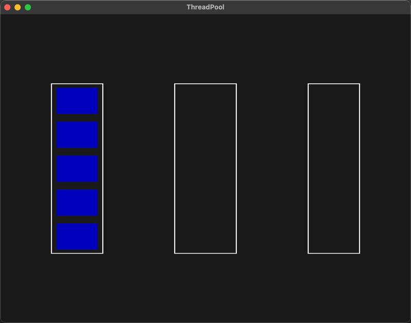

基于VulkanLearning视频的简单引擎实现的线程池可视化

https://github.com/blurrypiano/littleVulkanEngine/tree/master

v0.1

简单的可视化，项目有不可复现的bug，没有去掉原有项目的特性，以及分层一团糟的问题

左边是线程池，中间是任务执行区域，右边是任务等待区域

按1～5可以生成执行时间为1～5秒的睡眠任务

待实现：

异步执行的回调，修复不可复现的bug，去掉原有项目特性，尝试分层