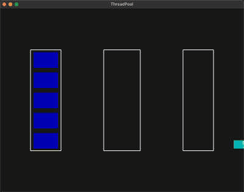

基于VulkanLearning视频的简单引擎实现的线程池可视化

https://github.com/blurrypiano/littleVulkanEngine/tree/master

**v0.1**

简单的可视化，项目有不可复现的bug，没有去掉原有项目的特性，以及分层一团糟的问题

左边是线程池，中间是任务执行区域，右边是任务等待区域

按1～5可以生成执行时间为1～5秒的睡眠任务

实际上是3D项目，按键盘的按键可以移动摄像机，可以看到任务初始地点以及各个矩形的层级：

+ Q:向下，E:向上
+ W:向前，S:向后
+ A:向左，D:向右

**v0.2**

给bug打上补丁，bug仍然存在，大概率是多线程导致，README添加动图

**v0.3**

大概修复了bug，原因是任务队列系统写挂了，但具体逻辑未知

把原项目中用不到的特性进行删除

更改一些移动时逻辑

**待实现（可能也不会实现）：**

异步执行的回调，尝试分层

