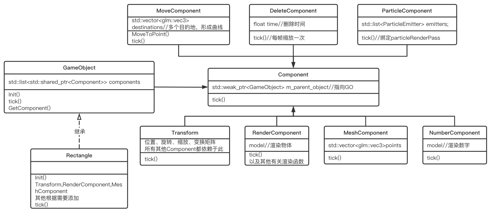

基于VulkanLearning视频的简单引擎实现的线程池可视化

https://github.com/blurrypiano/littleVulkanEngine/tree/master

左边是线程池，中间是任务执行区域，右边是任务等待区域

按1～5可以生成执行时间为1～5秒的睡眠任务

同时用来实验C++书籍中的条款

存在简单的异步执行，更多说明在v1.2分支README中

**v2.0**

+ 大重构（感谢学长给的基本架构）

+ 去除3D特性（以后继续尝试添加）

+ 更好的分层以及优化主循环（依旧模仿Piccolo小引擎)，https://github.com/BoomingTech/Piccolo

+ v1.2版本在另一个分支中

+ 存在莫名其妙的bug导致界面不初始化或出现段错误

+ Rectangle的相关类图

**v2.1**

+ 修复BUG（大概，原因系Window初始化时height和width还没生成，以及RenderSystem成员变量未正确初始化）

**v2.2**

+ Task完成后动画完成（加入原有model类）

+ 修改类名和文件名

+ 为Component类加入dirty机制

**v2.3**

+ 根据C++书籍提供的一些条款进行小改动

+ 将render_pass归类

**v3.0**

+ 添加了一个极其丑陋的删除粒子动画（甚至算不上粒子）

+ 调整资源结构

**v3.1**

+ 为了去除bind改用lambda（实现条款），改用C++20(C++20 deprecated了volatile float，glm库会报警告)

+ 修改README

+ 调整ParticleComponent的参数，使其效果更佳（但还是很丑陋）

+ 模仿GetComponent调整Component的添加方式，默认实现type，使Component更有扩展性

**v3.2**

+ 使粒子效果更好看，包括粒子颜色渐变，增加粒子以抗锯齿（我真的在努力做火焰效果了，其实也许红色拖影更好看？）

+ 修复了Task乱飞的bug（大概，此bug 100个Task也不一定会出现，所以未知是否修好）

+ 修改移动逻辑

**待实现（可能也不会实现）：**

+ 更好的异步执行（Job System）

+ 尝试更更好的分层

+ 任务执行完删除资源（验证层报错，不会改，接口已实现）

+ 继续模仿Piccolo小引擎优化主循环

+ 更好的粒子系统（搞不明白），更好的粒子系统tick逻辑

+ 求出多面体的凸包，而不是严格限制顶点顺序（不想写）

    + 白框（即空矩形）需按边顺序放点

    + 满矩形需按右上、左上、右下、左下的顺序放点（主要为了task的删除动画）